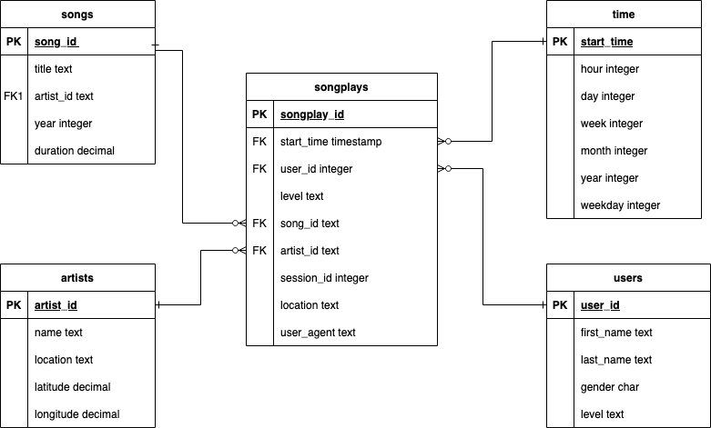

# Sparkify Data Warehouse

## Overview

A music streaming startup, Sparkify, has grown their user base and song database and want to move their processes 
and data onto the cloud. Their data resides in S3, in a directory of JSON logs on user activity on the app, as well
as a directory with JSON metadata on the songs in their app.

## Goals

The goal of the project is to process and transform the data stored in S3 build a star schema that allows the analytics
team to easily and efficiently query the data to gather insights into what songs user are listening.

## Schema Design

The database for this project uses a star schema with one fact table, songplays, and for dimension tables -- users, songs,
artists, and time. This design was chosen so the data can be easily joined and aggregated. 



## ETL Pipeline

Three python files are included in this project:

1. sql_queries.py - contains all of the DDL and DML for this project
1. create_tables.py - runs the DDL to create the structure of our data warehouse
1. etl.py - run the copy commands contained in the sql_queries.py to populate our data warehouse

To run the scripts: 

1. update the configuration file `dwh.cfg` with the appropriate database information and IAM role
1. run `python create_tables.py`
1. run `python etl.py`

## Project Dataset

### Song Dataset

The first dataset is a subset of real data from the Million Song Dataset. Each file is in JSON format and contains metadata about a song and the artist of that song. The files are partitioned by the first three letters of each song's track ID. For example, here are filepaths to two files in this dataset.

```
song_data/A/B/C/TRABCEI128F424C983.json
song_data/A/A/B/TRAABJL12903CDCF1A.json
```

And below is an example of what a single song file, TRAABJL12903CDCF1A.json, looks like.

```
{
    "num_songs": 1,
    "artist_id": "ARJIE2Y1187B994AB7",
    "artist_latitude": null,
    "artist_longitude": null,
    "artist_location": "",
    "artist_name": "Line Renaud",
    "song_id": "SOUPIRU12A6D4FA1E1",
    "title": "Der Kleine Dompfaff",
    "duration": 152.92036,
    "year": 0
}
```

### Log Dataset

The second dataset consists of log files in JSON format generated by this event simulator based on the songs in the dataset above. These simulate app activity logs from an imaginary music streaming app based on configuration settings.

The log files in the dataset you'll be working with are partitioned by year and month. For example, here are filepaths to two files in this dataset.

```
log_data/2018/11/2018-11-12-events.json
log_data/2018/11/2018-11-13-events.json
```
