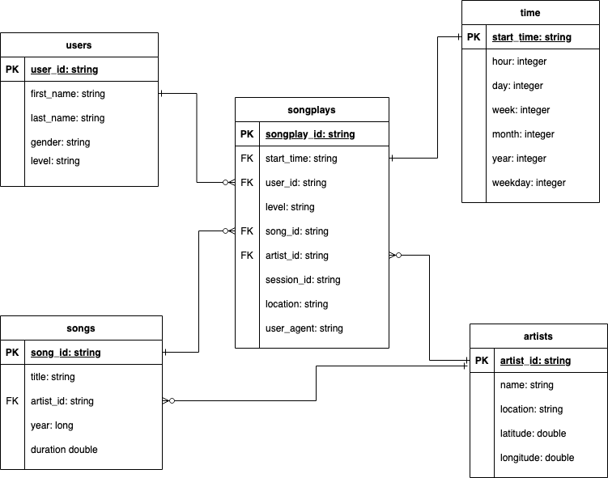

# Project 4: Data Lake

In this project, you'll apply what you've learned on Spark and data lakes to build an ETL pipeline for a data lake hosted on S3. To complete the project, you will need to load data from S3, process the data into analytics tables using Spark, and load them back into S3. You'll deploy this Spark process on a cluster using AWS.

## Getting Started

This project requires Python 3 and to get started following the steps below:

1. Copy `dl.example.cfg` to `dl.cfg` and replace the keys `AWS_ACCESS_KEY_ID` and `AWS_SECRET_ACCESS_KEY` with you AWS credentials
2. Install the project requirements running `pip install -r requirements.txt`
3. Run `python etl.py`

This will create the folder `./tables` which will contain the "normalized" database tables.

## Sparkify Database

In order to handle the increasing demands of the analytics and ML teams, Sparkify wants to move their JSON log files on song plays to a "data lake." To support these users a the JSON log files
are being processing into a new DB modeled after a star schema. The database consists of one fact table, songplays, and four dimensions -- users, artists, songs, and time. Star schema was chosen
to provide simple joins and simple queries to support various analytics requests. The image below depicts the tables and their relationships.

## ETL Pipeline

To build the data lake, the ETL process works two set of data -- songs and logs. As part of the ETL process all column names have been standardized to be lower cased and in snakecase format. All tables are written out as parquet files as it is a columnar file storage that is efficient in his size and in it's ability to perform data aggregations.
### songs data
1. extracts the raw song data 
2. creates a song table extracting the fields -- song_id, title, artist_id, year, and duration
3. writes the song data to a parquet file that is partitioned by year and artist id
4. creates an artist table extracting the the fields -- artist_id, name, location, latitude, longitude
5. the artist table is then written out a parquet file, but not partitioned as the data will be relatively small

### log data
1. extracts and process log files
2. as only the song plays are of interest a DataFrame is created where the page is equal to "NextSong"
3. the users table is created from the log file with only distinct rows being added to the table
4. the users table is written to a parquet file and indexed as the size of the data is relatively small
5. the time table is created next extracting a proper timestamp column and the individual components of the date pre-computed to make querying the data easier
6. lastly the songplays table which represent an indiviual play of song is derived by joining the log entries on the songs table
7. the songplays table is partition by year and month

## Sample Queries

