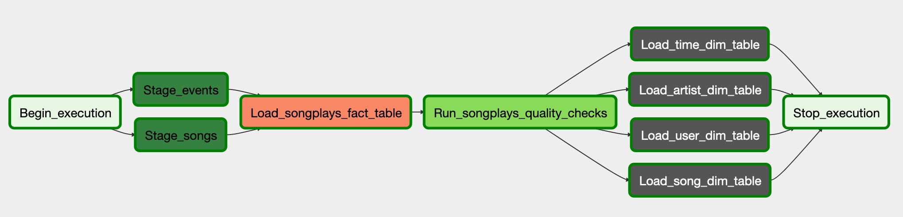
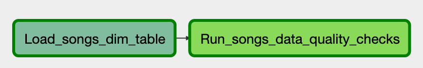

# Project 5: Data Pipelines with Airflow

Build a high grade data pipeline that is dynamic and built from reusable tasks, can be monitored, and allows for easy backfills. Also to 
be included are data quality checks on the data warehouse to be run after the ETL steps have been executed to catch any discrepancies
in the datasets.

## Getting Started

This project is intended to be run inside of an Apache Airflow instance. The easiest way to the project is by using Docker and the 
Docker compose file (docker-compose.yaml) contained in this repository. Follow the steps below to quickly get up and running:
1. Create a Redshift cluster that is accessible
2. Run the table creation script
   * copy `project_5_example.cfg` to `project_5.cfg`
   * update the configuration with the correct values
   * run `python create_tables.py`
3. Start the Airflow cluster by running `docker-compose up`
4. Visit the Airflow webserver at http://localhost:8080 and set the following connections:
   * aws_credential - your AWS access credentials
   * redshift - connection settings for the cluster created in step #1
5. Trigger the `project_5` DAG from the Airflow UI

## Data Pipeline Overview

The purpose of this pipeline is to populate the data warehouse built in previous projects. To accomplish this one main DAG has been
created to populate the fact table and several dimension tables. The main DAG, `project_5_dag`, performs the following tasks:
1. Staging the events and song data from files stored in S3
2. Loading the fact table
3. Performing Quality checks on the fact table
4. Loading the dimension via a subdag, the subdag performs the following operations
   * Loads a dimension table from a supplied SQL statement
   * Performs a data quality check

The image below is graphical representation of the main DAG:

The following image depicts the sub-DAG responsible for populating a dimension table and running data quality check:

The DAG is configured with a `start_date` of 2018-01-11, with `retries` set to 3, and a `retry_delay` of 5 minutes. The DAG is scheduled
to run every hour. 